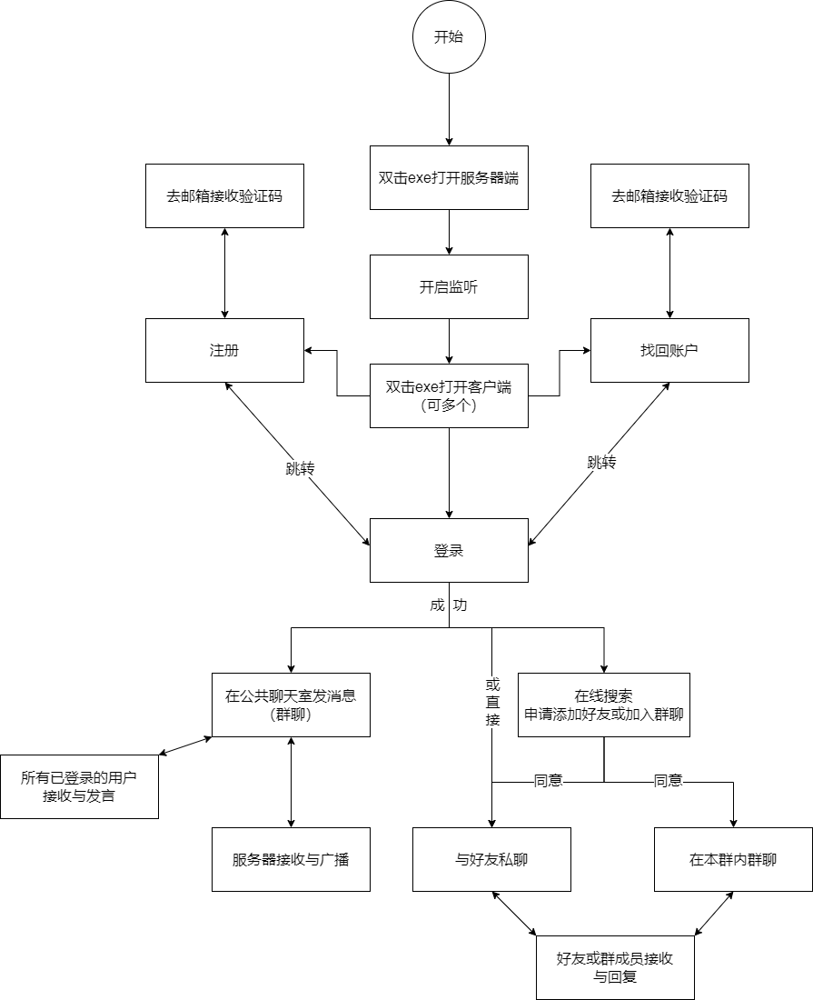
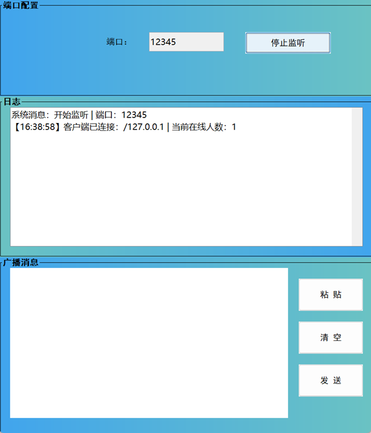
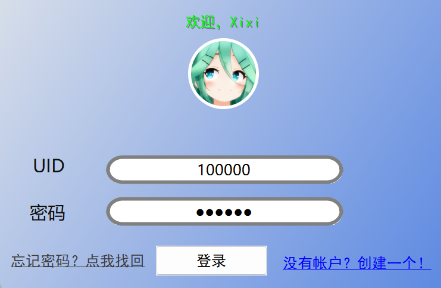
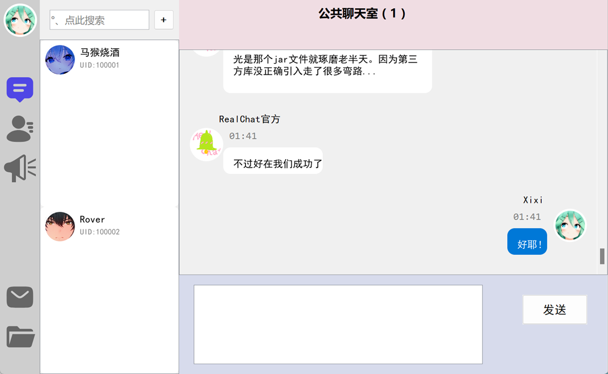
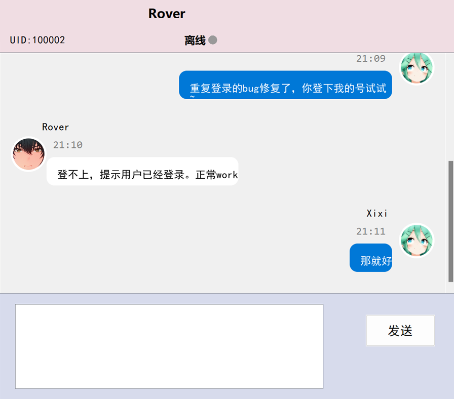
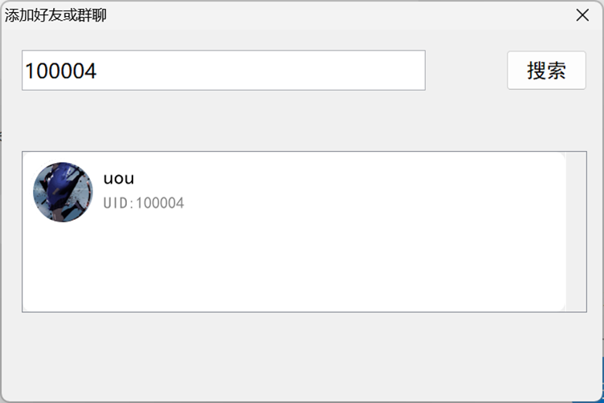

# RealChat

❗该仓库为本人在线聊天室项目的git重传和归档，为已完结项目，仅作学习用途，不再后续更新。

# Introduction

该项目为基于java的 Socket即时通信软件RealChat的设计与实现。桌面应用界面采用java swing框架，纯代码“绘制”(~~it really took most of my dev time~~)。

# Protocols

协议为自制协议，参见设计文档：[protocols](Protocols.txt)

# Design (flow)

其他当时的设计草图（~~真的很潦草~~）：[design_charts文件夹下](design_charts/)

# Effect

当时的展示画面的部分截图：

## Server UI

## Client UI

### Login (Failed)

### Login (Passed)

### Register

### Chat (public)

### Chat (private)

### Add Friends

# Note

如要编译运行，请将源码文件SMsgProcessor.java中，resolveRetrieve函数内的`String email = "example@qq.com";`的邮箱更换为读取config.ini中配置的邮箱（~~当时没考虑到这一点~~）的代码。

---

# 以下是原注意事项：

RealChat开头两个的文件夹为源码文件；

另外两个为资源文件夹（包括数据库）。

已注册100000~100006七位用户，密码均为123456.以供测试。

若想测试找回密码功能，请不要用以上账号（它们的注册邮箱是随便填的），而用你新注册的账号。
